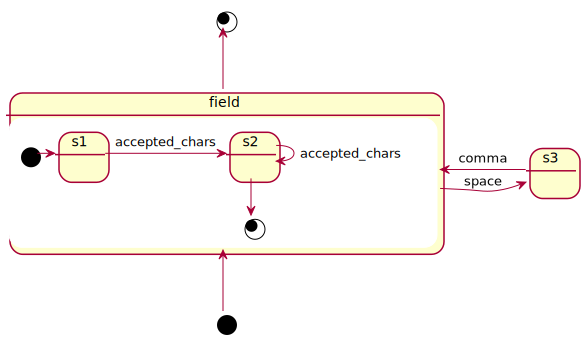

# State Machines
Gerardo Gonzalez

@fmizzell


#


And [non-standar CSVs](https://chriswarrick.com/blog/2017/04/07/csv-is-not-a-standard/)

# Theory of Computation

<small>
... is the branch that deals with how efficiently problems can be solved on a model of computation, using an algorithm.
</small> 

* automata theory and languages
* computability theory
* computational complexity theory

#

 

#  Entscheidungsproblem

#


#


# Halting Problem

#


#


# Back to CSV

#

<pre>
(?:(?:\r\n)?[ \t])*(?:(?:(?:[^()<>@,;:\\".\[\] \000-\031]+(?:(?:
(?:\r\n)?[ \t])+|\Z|(?=[\["()<>@,;:\\".\[\]]))|"(?:[^\"\r\\]|\\.
|(?:(?:\r\n)?[ \t]))*"(?:(?:\r\n)?[ \t])*)(?:\.(?:(?:\r\n)?[ \t]
)*(?:[^()<>@,;:\\".\[\]\000-\031]+(?:(?:(?:\r\n)?[ \t])+|\Z|(?=
[\["()<>@,;:\\".\[\]]))|"(?:[^\"\r\\]|\\.|(?:(?:\r\n)?[ \t]))*"
(?:(?:\r\n)?[ \t])*))*@(?:(?:\r\n)?[ \t])*(?:[^()<>@,;:\\".\[\] 
\000-\031]+(?:(?:(?:\r\n)?[ \t])+|\Z|(?=[\["()<>@,;:\\".\[\]]))|
\[([^\[\]\r\\]|\\.)*\](?:(?:\r\n)?[ \t])*)(?:\.(?:(?:\r\n)?[ \t]
)*(?:[^()<>@,;:\\".\[\]\000-\031]+(?:(?:(?:\r\n)?[ \t])+|\Z|(?=[
\["()<>@,;:\\".\[\]]))|\[([^\[\]\r\\]|\\.)*\](?:(?:\r\n)?[ \t])*)
)*|(?:[^()<>@,;:\\".\[\] \000-\031]+(?:(?:(?:\r\n)?[ \t])+|\Z|(?=
[\["()<>@,;:\\".\[\]]))|"(?:[^\"\r\\]|\\.|(?:(?:\r\n)?[ \t]))*"(
?:(?:\r\n)?[ \t])*)*\<(?:(?:\r\n)?[ \t])*(?:@(?:[^()<>@,;:\\".\[\]
\000-\031]+(?:(?:(?:\r\n)?[ \t])+|\Z|(?=[\["()<>@,;:\\".\[\]]))|
\[([^\[\]\r\\]|\\.)*\](?:(?:\r\n)?[ \t])*)(?:\.(?:(?:\r\n)?[ \t])*
(?:[^()<>@,;:\\".\[\] \000-\031]+(?:(?:(?:\r\n)?[ \t])+|\Z|(?=[\["
()<>@,;:\\".\[\]]))|\[([^\[\]\r\\]|\\.)*\](?:(?:\r\n)?[ \t])*))*(
?:,@(?:(?:\r\n)?[ \t])*(?:[^()<>@,;:\\".\[\] \000-\031]+(?:(?:(?:
\r\n)?[ \t])+|\Z|(?=[\["()<>@,;:\\".\[\]]))|\[([^\[\]\r\\]|\\.)*\]
(?:(?:\r\n)?[ \t])*)(?:\.(?:(?:\r\n)?[\t])*(?:[^()<>@,;:\\".\[\] 
\000-\031]+(?:(?:(?:\r\n)?[ \t])+|\Z|(?=[\["()<>@,;:\\".\[\]]))|\
[([^\[\]\r\\]|\\.)*\](?:(?:\r\n)?[ \t])*))*)*:(?:(?:\r\n)?[ \t])*)?
(?:[^()<>@,;:\\".\[\] \000-\031]+(?:(?:(?:\r\n)?[ \t])+|\Z|(?=[\["
()<>@,;:\\".\[\]]))|"(?:[^\"\r\\]| ...
</pre>

#

> Regular expressions describe regular languages

> A regular language can be defined as a language recognized by a finite automaton

#


* a
* accccc
* ab
* abcc

#


* 1c
* 5bcc


#


* accccc ,ab, abcc

# Back to CSV ... Again!

#

<pre>
first_name, last_name, stuff\n\r
    Gerardo     , "Gonzalez Calle ", \\ After spaces\\, yes!\n\r
Camila, """Awesomeness"" Gonzalez", Great\\\nEscape\n\r
</pre>

#


#


#

```php
if ($endState == sm::STATE_RECORD_END) 
{
    $this->createNewRecord();
} 
elseif ($endState == sm::STATE_NEW_FIELD) 
{
    $this->createNewField();
} 
elseif (
  $endState == sm::STATE_CAPTURE || 
  $endState == sm::STATE_QUOTE_CAPTURE
) 
{
    $this->addCharToField($input);
}
```

#

```sql 
SELECT field1,field2 FROM blah;
```
```sql
SELECT * FROM blah;
```

#


#



# Takeaways

* State machines are simple but powerful
* Constraints can help simplify, and crystalize systems
* Validating, parsing, categorizing, control-systems 

# Recommendation

* !Implementation -> Mental exercise

# Resources

* [PHP State Machine Library](https://github.com/fmizzell/maquina)
* [State-Machine-Driven CSV Parser](https://github.com/getdkan/csv-parser)
* [JS State Machine Implementation](https://github.com/davidkpiano/xstate)
* [Debug Regular Expressions](https://regex101.com)
* [Diagrams as Text](http://plantuml.com/)
* [Diagrams as Test Editor](https://www.planttext.com)
* [Presentation as Text](https://github.com/arnehilmann/markdeck)

# Q&A
@fmizzell